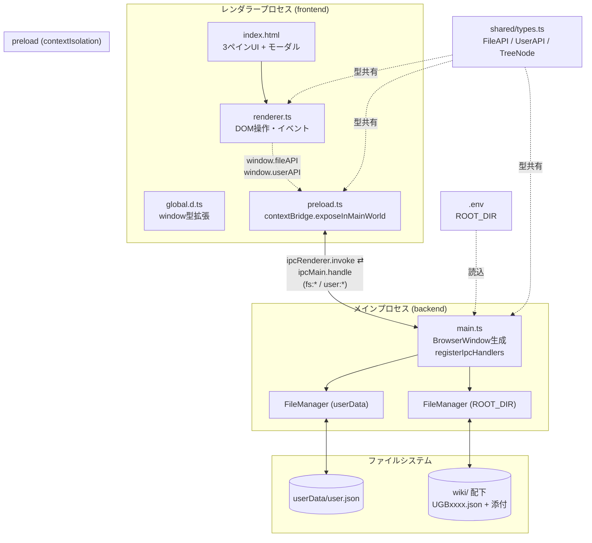
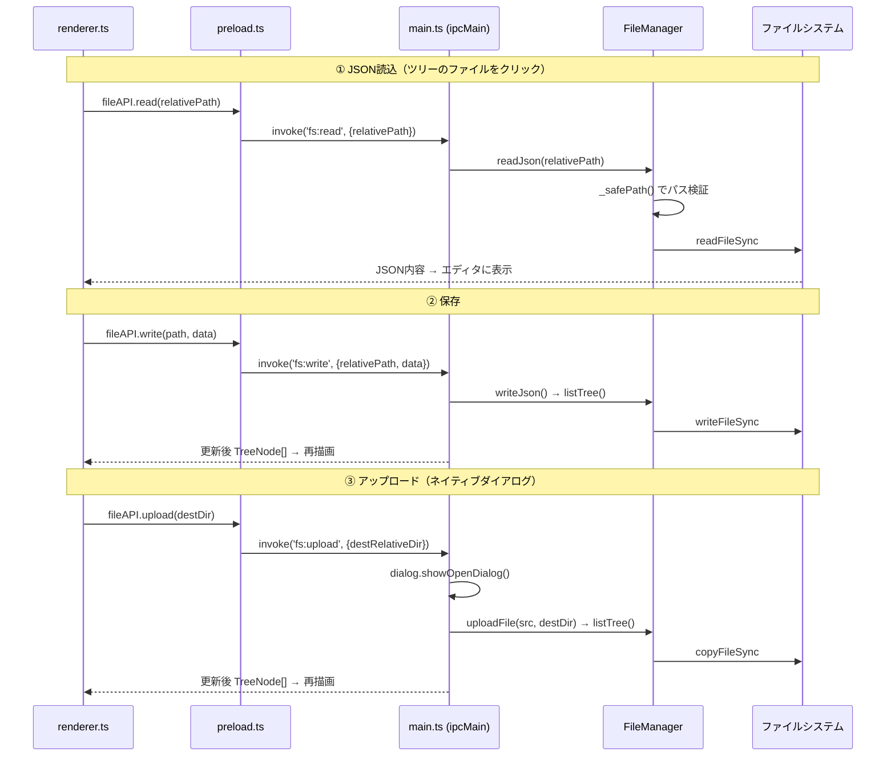
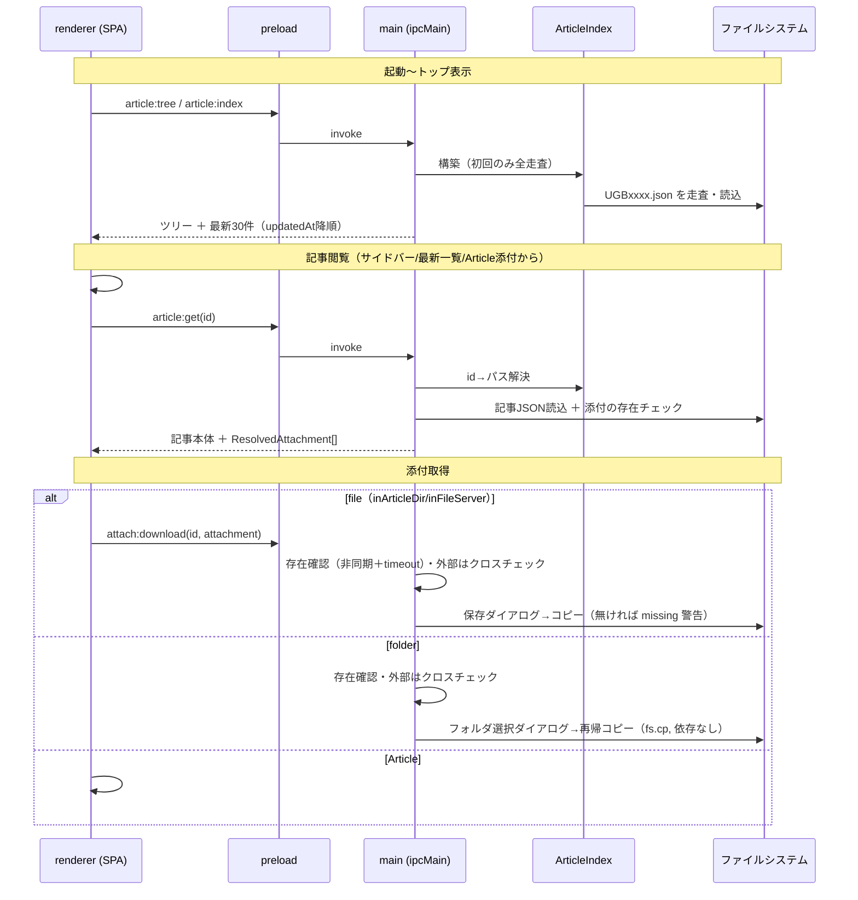

# アーキテクチャ

社内Wikiアプリ（技術検証フェーズ）のアーキテクチャをまとめる。
Electron + TypeScript による 3プロセス構成（メイン / preload / レンダラー）で、
`.env` の `ROOT_DIR`（現状は `wiki/`）を対象に、JSONの閲覧・編集・作成・削除、
および任意ファイルのアップロード / ダウンロードを行う。

## ディレクトリ構成

```
src/
├── backend/            メインプロセス
│   ├── main.ts           BrowserWindow生成・IPCハンドラ登録・起動制御
│   └── fileManager.ts    実ファイルI/O（ツリー構築・JSON読書・DL/UL・パス検証）
├── preload/
│   └── preload.ts        contextBridge で fileAPI / userAPI を安全公開
├── frontend/           レンダラープロセス
│   ├── index.html        3ペインUI + ユーザーモーダル
│   ├── renderer.ts       DOM操作・イベント・IPC呼び出し
│   ├── style.css         デザイントークン + スタイル
│   └── global.d.ts       window.fileAPI/userAPI と TreeNode のグローバル型
└── shared/
    └── types.ts          フロント/バック共通の型・IPCペイロード定義
```

## プロセス構成・データフロー



## IPCチャネル一覧

すべてのハンドラは `main.ts` の `registerIpcHandlers` に集約している。

| チャネル | 処理 | 備考 |
| --- | --- | --- |
| `fs:getRootDir` | ROOT_DIR文字列を返す | |
| `fs:list` | ツリー（`TreeNode[]`）を返す | dir / json / file を区別、dir優先ソート |
| `fs:read` | JSONを読み込む | |
| `fs:write` | JSONを書き込む（新規 / 上書き） | 更新後の新ツリーを返す |
| `fs:delete` | JSONを削除する | 更新後の新ツリーを返す |
| `fs:download` | ネイティブ保存ダイアログ → コピー | |
| `fs:upload` | ネイティブ開くダイアログ → コピー | 単一ファイル |
| `user:get` | ユーザー名を取得（未登録なら null） | userData配下の `user.json` |
| `user:save` | ユーザー名を保存 | 同上 |

## IPCシーケンス（代表フロー）



## 設計上のポイント

- **2つの FileManager インスタンス** — Wikiデータ用（`ROOT_DIR`）と、ユーザー情報用
  （`app.getPath('userData')`）を分離。後者はインストール後も書き込み可能な領域を意図している。
- **パストラバーサル対策** — `FileManager._safePath` が `rootDir` 外へのパス解決を拒否する。
- **型の一元管理** — `shared/types.ts` の `FileAPI` / `UserAPI` / `TreeNode` を
  preload実装・`global.d.ts`・`renderer.ts` が共有する。
- **セキュリティ** — `contextIsolation: true`、`nodeIntegration` 無効。
  Node機能へは preload 経由でのみ到達する。
- **ビルド** — `tsc` でJSへコンパイルし、HTML / CSS を `dist/frontend/` へコピーする
  （`package.json` の `build`）。エントリポイントは `dist/backend/main.js`。

## 現状と今後のギャップ

現在のUIは汎用の「JSONファイルマネージャー」（生JSONを textarea で編集）であり、
記事志向のWikiビューア（記事カード表示、`spaceSkill`（business / skill）や
添付3方式（inArticleDir / inFileServer / Article）の構造化表示、関連記事リンク）とは
レイヤーが異なる。現状の `TreeNode` は `json` / `file` / `dir` の汎用分類のみで、
`UGBxxxx.json` の記事スキーマや添付方式は認識していない。

次章では、この汎用マネージャーを Wikiアプリ化するための拡張アーキテクチャ案を示す。

---

# Wikiアプリ拡張アーキテクチャ案

トップページ・記事閲覧ページを実装するための設計案。まずはミニマルに始め、
記事作成・編集・検索は後続で追加する前提とする。既存の 3プロセス構成・
`user:*`（ユーザー名）・`fs:getRootDir` は維持する。

## 画面構成とルーティング

単一ウィンドウ内でハッシュベースのクライアントサイドルーティングを行う（ローカルアプリのため）。
記事間リンク・Article添付の遷移は「ハッシュを変えるだけ」で表現でき、深いリンクにも対応できる。
実装は現行の vanilla TypeScript を維持し、小さなルーター + ビューモジュールを足す方針とする
（UIフレームワーク導入は複雑化してから再検討）。

| ルート | 画面 | 内容 |
| --- | --- | --- |
| `#/` | トップ | 左サイドバー（Wikiツリー、表示/非表示・スクロール・展開収縮）＋ Wiki説明 ＋ 最新更新記事 約30件 |
| `#/article/:id` | 記事閲覧 | モックアップ準拠。本文・タグ・skill/business・添付3方式・関連記事リンク |
| `#/new` `#/edit/:id` `#/search` | （将来） | 作成・編集・検索 |

## ドメインモデル（記事志向の型）

汎用の `TreeNode` に加え、記事志向の型を `shared/types.ts` に追加する。

```ts
// 添付は3種のユニオン。type は "file" | "folder"、Article は method で表現
// file は ext を持ち、folder は ext なし（DL時は ZIP化せず fs.cp で再帰コピー）
type FileAttachment    = { type: 'file' | 'folder';
                           method: 'inArticleDir' | 'inFileServer';
                           name: string; ext?: string; path?: string };
type ArticleAttachment = { type: 'article'; method: 'Article'; id: string };
type AttachmentRef     = FileAttachment | ArticleAttachment;

interface Article {
  id: string; title: string; author: string;
  createdAt: string; updatedAt: string;   // ISO 8601 JST: "YYYY-MM-DDTHH:MM:SS+09:00"
  tags: string[];
  spaceSkill: { business: string[]; skill: string[] };
  body: string;
  attachments: AttachmentRef[];
}

// 一覧・サイドバー・検索用の軽量サマリ
interface ArticleSummary {
  id: string; title: string; author: string;
  createdAt: string; updatedAt: string; tags: string[];
  relativePath: string;      // UGBxxxx/UGBxxxx.json
  categoryPath: string[];    // 例: ["プロジェクト別","H3","第1段開発"]
}

// 記事取得時、添付は解決済みメタを付与して返す
interface ResolvedAttachment {
  ref: AttachmentRef;
  exists: boolean;           // 実在チェック結果（パス切れ検出）
  displayName: string;
  linkedTitle?: string;      // Article添付のとき、遷移先記事のタイトル
}
```

備考: 現行サンプルの `attachment.type` は `"file"` のみ。フォルダ添付を実装する際は
`"folder"` を追加し、サンプルデータも追随させる必要がある。

## メインプロセスの記事インデックス

サイドバーのタイトル表示・最新一覧・Article添付の解決は、いずれも全記事のメタを要する。
共有ファイルサーバ上で多数の小さなJSONを読むのは低速なため、メインプロセスで
**インデックスを一度構築してキャッシュ**する。

- 構造: `Map<articleId, { summary: ArticleSummary }>` ＋ カテゴリツリー
- 構築: `ROOT_DIR` を走査し、`^UGB\d+$` ディレクトリ内の `UGBxxxx.json` を読む。
  `attachments/` はWikiツリーからはSkipする（記事閲覧時のみ参照）
- 無効化: 起動後の初回要求で遅延構築し、書込/削除・手動更新で再構築
- 制約: ネットワークドライブでは `fs.watch` が不安定なため自動反映は当てにせず、
  「更新ボタン＋書込時再構築」に寄せる。多人数同時編集時のインデックス陳腐化は残課題
- スケール: 数千件・低速回線では初回全走査が重い。将来は `index.json` の永続化＋
  mtime差分更新を検討（多人数書込での整合は別課題）
- 並び順: `createdAt` / `updatedAt` は ISO 8601（JST）`YYYY-MM-DDTHH:MM:SS+09:00` の時刻粒度を持ち、
  最新更新順を厳密に決定できる（全記事で `updatedAt >= createdAt` を保証済み）

## IPCチャネル（拡張）

記事志向のチャネルを追加する。既存 `fs:*` は将来の作成・編集で流用するため残す。

| チャネル | 処理 | 返却 |
| --- | --- | --- |
| `article:tree` | カテゴリ＋記事タイトルのツリー（サイドバー） | ツリー構造 |
| `article:index` | 記事サマリ配列（最新一覧・将来の検索） | `ArticleSummary[]` |
| `article:get` | 記事本体＋添付の解決メタ（存在フラグ・遷移先タイトル） | `Article` ＋ `ResolvedAttachment[]` |
| `attach:download` | 添付の取得（file / folder→ZIP / 外部パス） | `'ok' \| 'canceled' \| 'missing'` |

## 添付取得の設計

添付の `method` ごとに解決方針とダウンロード経路を分ける。

| method | パス解決 | 取得方法 | 備考 |
| --- | --- | --- | --- |
| `inArticleDir` | 保存済み絶対パスは信用せず `<記事Dir>/attachments/<name>` を**再構築** | 保存ダイアログ→コピー | ROOT_DIR内。`_safePath` 保護がそのまま有効 |
| `inFileServer` | 保存済みの**絶対パスをそのまま使用**（ROOT_DIR外＝外部）。マシン依存を許容 | **外部DL経路**（下記） | 例 `//bvd120/...`。パス切れは警告で担保 |
| `Article` | `id` → インデックスで記事パス解決 | （DLではなく）`#/article/:id` へ遷移 | ダングリングIDは警告 |
| `folder`（type） | 上記いずれかで解決 | **フォルダのまま再帰コピー**（`fs.promises.cp` recursive、依存なし） | ZIP化しない。保存先はフォルダ選択ダイアログ |

### ファイル / フォルダの取得

- **ファイル**: 保存ダイアログ（`showSaveDialog`）→ コピー。
- **フォルダ**: フォルダ選択ダイアログ（`showOpenDialog` の `openDirectory`）→
  `fs.promises.cp(src, dest, { recursive: true })` で**そのままコピー**。
  Node標準機能のため**追加依存は不要**（ZIPは採用しない）。大きなフォルダでUIをブロックしないよう
  同期版 `cpSync` ではなく**非同期**で行う。保存先に同名フォルダがある場合の扱い
  （マージ / 中止 / 連番付与）は `{ force, errorOnExist }` で制御する。

### inFileServer（外部絶対パス）の方針と注意点

既存運用（`//bvd120/...` 等の共有パスを関係者間で共有してアクセスする）の延長として、
**マシン依存の絶対パスをそのまま保持**する。可搬性の正規化（共有ルート設定＋相対パス）は当面見送り。
そのうえで以下を前提とする。

- **パス切れ警告**: DL前に存在確認し、無ければ**当該パスを添えて**警告する。
  存在確認は**非同期＋タイムアウト**で行い、到達不能な共有でUIが固まらないようにする。
  可能なら *not found*（パス切れ）と *access denied*（権限なし）を出し分ける。
- **クロスOSは対象外**: `//bvd120/...` は Windows UNC 表記。利用者が全員 Windows・同一ネットワークなら
  一様に解決できる。macOS では SMB共有が `/Volumes/...` にマウントされ、この表記のままでは解決できないため、
  **開発機（macOS）では inFileServer の実DL検証はできない**（常にパス切れ判定）。本番Windowsで動作する想定。
- **表記の一貫性**: クロスチェック・比較のため、保存する表記（スラッシュ方向・末尾）は統一する。

## セキュリティ境界の拡張

- `inArticleDir` / カテゴリ: 従来どおり `_safePath` で ROOT_DIR 内に封じ込め。
- `inFileServer` の外部DL: 封じ込めを外す必要があるため、**レンダラーが任意パスを要求できない**よう、
  メイン側で「要求パスが対象記事（`article:get` で読んだ添付）に実在するか」をクロスチェックしてから
  ダウンロードを許可し、信頼境界を保つ。
- `folder` の再帰コピーも、解決先が許可範囲（inArticleDirなら記事Dir配下、inFileServerなら上記クロスチェック済み）
  であることを確認してから実行する。

## トップページのナビゲーション・添付取得シーケンス



## 決定事項

- **フォルダ添付**: ZIP化せず、`fs.promises.cp` による**フォルダそのままの再帰コピー**とする（追加依存なし）。
- **`inFileServer`**: **マシン依存の絶対パス**（例 `//bvd120/...`）をそのまま保持する。
  可搬性の正規化は当面見送り、**パス切れ警告**（非同期＋timeout、パス表示、可能なら権限エラーと出し分け）で担保する。
  クロスOSは対象外（開発機 macOS では実DL検証不可、本番 Windows 想定）。
  なお外部DLの仕組み自体はパス文字列に依存しないため、**macOS ローカルの絶対パスを指定すれば
  DL挙動（存在確認・コピー・パス切れ警告）は Mac 上でも検証できる**（`//bvd120` の綴りのみ Windows 専用）。
- **添付スキーマ `type:"folder"`**: 追加済み。`file` / `folder` / `article` の3 type、
  `inArticleDir` / `inFileServer` / `Article` の3 method。`folder` は `ext` を持たない。
  サンプルデータにも inArticleDir / inFileServer のフォルダ添付を投入済み。
- **トップの「Wiki説明」文言**: まずは **HTML / TS にハードコード**する（再ビルドで更新）。
  運用で頻繁に変えたくなったら `wiki/` 配下の設定ファイル化へ移行する。
- **UI方針**: **vanilla TypeScript を継続**（小さなハッシュルーター＋ビューモジュールを自作）。
  編集フォームや検索で状態管理が複雑化した段階で、フレームワーク導入を再検討する。

---

# 記事本文の Markdown 分離（実装済み）

各記事は `UGBxxxx.json`（メタ）＋ `UGBxxxx.md`（本文）＋ `attachments/` で構成する。
`Article.body` はメモリ上の表現として維持し、`getArticleDetail` 時にのみ `<id>.md` を読み込む
（`ArticleManager.readBody`）。インデックス構築・添付/リンク解決は本文を読まないため一覧・ツリーの性能は不変。
将来の Markdown レンダリング時はライブラリ追加＋HTMLサニタイズ（XSS対策）を別途行う。

---

# 新規記事作成機能（実装済み）

トップページ／ディレクトリページの「＋ 新規記事作成」ボタンから `#/new`（初期ディレクトリ付きは
`#/new/<categoryPath>`）へ遷移し、フォームで作成する。既存記事編集は本機能の後続とする。

## スキーマ管理（単一の真実源）

JSONスキーマ知識を機能側へ散らさないため、`src/backend/articleSchema.ts` に集約する。

- `validateCreateInput(input, validators)` … タイトル/本文必須（トリム後1文字以上）、ディレクトリ名、
  スキル/業務ID、関連記事ID、URLスキームを一元検証
- `buildArticleRecord(params)` … JSON本体（キー順固定・body除外）と本文Markdownを構築
- `serializeArticleJson` … 4スペースインデントで直列化（既存Wikiデータと統一）
- 添付ビルダー（`inArticleDirAttachment` / `fileServerAttachment` / `articleAttachment` / `linkAttachment`）で
  AttachmentRef の内部キー順も固定
- `normalizeAbsolutePath`（前後空白＋囲みダブルクォート除去）、`baseName`（`/` `\` 両対応）、
  `extOf`、`validateDirName`、`nowJstIso`（ホストTZ非依存で `+09:00`）

`ArticleManager.createArticle` は「ディレクトリ生成 → ID採番 → 添付コピー → schemaで組立 → json/md書込」の
手順のみを持ち、スキーマ知識を持たない。

## IPC（追加）

| チャネル | 内容 |
| --- | --- |
| `matrix:options` | スキル/業務の全候補（id・label・major）。`SkillMatrix.options()` |
| `dialog:pickPath` | ファイル/フォルダ選択ダイアログ（mode指定）。**コピーはしない**（ステージング用）。絶対パス・種別・名前を返す |
| `article:create` | `CreateArticleInput` を受けて記事一式を生成し `{ id }` を返す |

作成者名は userData の `user.json` を正としてメイン側で解決する（匿名時は `"匿名"`）。

## 入力仕様（確定事項）

- **配置先**: 既存カテゴリのプルダウン＋新規サブディレクトリ（ネスト可）。トップからはルート直下が既定
- **作成者/更新者**: 起動ユーザー名を自動採用。作成時は両者同一。**匿名モード**（既定オフ）で両者 `"匿名"`（別フラグは持たない）
- **タイトル・本文**: ともに必須（本文はトリム後1文字以上）。本文はプレーンテキスト（md へ保存）
- **タグ**: 自由入力＋既存タグの datalist サジェスト
- **スキル・業務**: CSV由来の候補から選択のみ（新規不可）。major で optgroup グルーピング
- **添付（複数・方式をプルダウン選択）**:
  - ファイルアップロード → `dialog:pickPath` で選択 → 保存時に `attachments/` へコピー（file/folder）
  - ファイルサーバ絶対パス → **手入力のみ**。囲みダブルクォートを除去して正規化。file/folder は
    拡張子有無で**自動判定＋手動上書き可**。リンク切れ注意を明示
  - 他記事 → id＋タイトルの datalist サジェスト
  - 外部リンク → URL入力（http/https のみ）

## 技術課題への対応

- **ID採番の競合**（共有サーバ）: `max+1` の後に記事ディレクトリを**排他作成（EEXISTなら次IDへリトライ）**して回避
- **書き込みの非原子性**: 途中失敗時は作成ディレクトリを撤去（クリーンアップ）
- **タイムゾーン**: `nowJstIso()` でホストTZに依存せず `+09:00` を生成
- **インデックス陳腐化**: 作成後にローカル無効化・再構築。他ユーザーは更新ボタンで反映

## 検証済み（バックエンド）

一時ROOTでの疎通テストで、ID採番（UGB0001→UGB0002）・新規サブディレクトリ生成・json/md/添付コピー・
クォート付きパスの正規化・匿名時の `"匿名"`・本文空の拒否を確認済み。

---

# 既存記事の編集機能（実装済み）

記事閲覧ページ右上の「編集」ボタンから `#/edit/:id` へ遷移し、新規作成と同一のフォームを
**事前入力状態**で開く（`buildForm` を create/edit で共通化）。

## 保存セマンティクス
- `id` / `createdAt` / `createdBy` は**保持**、`updatedAt`=現在時刻（JST）、`updatedBy`=起動ユーザー（匿名時は `"匿名"`）
- スキーマ層の `buildArticleRecord` / `serializeArticleJson` を再利用し JSON＋MD を書き戻す
- 検証は `validateUpdateInput`（`validateCore` を create と共用。新規添付のみ `validateNewAttachment`）

## フォルダ移動（案A）
配置先フォルダを変更して保存すると、記事ディレクトリを移動する（`fs.renameSync`。id 不変）。
移動先に同名IDがあれば拒否。

## 添付の差分処理
編集フォームの添付一覧は「既存（`AttachmentRef`）」と「新規追加（`CreateAttachmentInput`）」の
混在（`EditAttachmentInput`）。保存時に `ArticleManager.updateArticle` が次を実施:
- 既存を維持 → そのまま採用（inArticleDir は再コピー不要、パス再構築）
- 既存を一覧から削除 → 保存時に `attachments/` の実体を削除（**孤児掃除**: 最終参照されない
  ファイル/フォルダを削除。空になれば `attachments/` も削除）
- 新規追加 → 新規作成と同じ解決（upload は `attachments/` へコピー）

## IPC（追加）
| チャネル | 内容 |
| --- | --- |
| `article:update` | `UpdateArticleInput` を受けて更新、`{ id }` を返す |

## 留意点
- **同時編集**: ロックなし（last-write-wins）。将来 `updatedAt` の楽観ロックを検討可
- **非原子性**: 移動・添付削除・書込は原子的でない。添付削除は不可逆（保存時に確定）

## 検証済み（バックエンド）
一時ROOTで、フォルダ移動（旧場所消滅）・添付の維持/削除/追加（孤児掃除）・
`createdAt`/`createdBy` 保持・`updatedBy` 更新・タイトル/タグ/スキル/本文の反映を確認済み。

---

# 検索機能（実装済み）

サイドバーは「検索」＋「Wikiツリー」の2段構成。検索対象で処理経路を分け、オーバーヘッドを抑える。

## キーワード検索（タイトル＋本文）
- バックエンドで実行。本文は `.md` にあるため、**初回検索時に一度だけ**全 `.md` を読み込み
  `id -> "タイトル\n本文"（小文字）` の**検索インデックスをメモリにキャッシュ**（`ensureSearchIndex`）。
  起動時には読まない（起動を遅くしない）
- `search(query)`: 空白区切りトークンの **AND 部分一致（大小文字無視）**、`updatedAt` 降順で `ArticleSummary[]` を返す
- キャッシュは `invalidate()`（作成/更新/削除・手動更新）で本体インデックスと一緒にクリア
- IPC `article:search`。UIは **Enter で実行**（キー打鍵ごとの処理なし）

## タグ検索
- レンダラーの `articleIndex`（タグを保持）を使い**クライアント側で即フィルタ**（IPCゼロ）
- サイドバーのプルダウンに全タグを列挙（`populateSearchControls`、データ変更時に再生成）

## 結果表示
- メイン画面の検索結果ページ（`#/search/kw/<q>` / `#/search/tag/<tag>`）に `latestRow` 一覧で表示。ツリーは維持

## 留意点
- 初回キーワード検索の `.md` 一括読み込みは、大規模・低速回線ではコスト（遅延＋キャッシュで緩和。将来はインデックス永続化）
- マルチユーザーのキャッシュ陳腐化（更新ボタンで再構築）
- 日本語は小文字化のみの正規化（全角/半角の同一視などは将来課題）

## 検証済み（バックエンド）
`要求事項`（本文のみの語）で本文検索がヒット、`HTV-X 運用` の AND、大小文字無視、空/該当なし=0件を確認。

---

# お気に入り機能（実装済み）

端末ローカル（ユーザーごと）の記事お気に入り。サイドバー構成は「検索」「お気に入り」「Wikiツリー」。

## 保存場所（ユーザーごと）
- `userData/favorites.json`（`{ ids: string[] }`）に記事IDを保存。`userData` は端末/OSユーザーローカルの領域で、
  `user.json` と同じスコープ（＝アプリを起動している各ユーザーごと）
- `FavoritesManager`（`FileManager(userData)` に保存、`ArticleManager` で存在検証）

## 起動時の存在チェック（プルーニング）
- `list()` / `toggle()` の度に、記事インデックスに存在しないID（削除済み）を除外して保存し直す
  （`ArticleManager.hasArticle(id)`）。サイドバーは起動時に `fav:list` を呼ぶため、実質「起動時チェック」になる

## IPC
| チャネル | 内容 |
| --- | --- |
| `fav:list` | 存在検証込みの有効なお気に入りID一覧 |
| `fav:toggle` | 登録/解除を切替、`{ favorited, ids }` を返す |

## UI
- 記事閲覧ページのアクション群に**星ボタン**（☆未登録 / ★登録済み・アンバー色）。クリックでトグル
- サイドバーの「お気に入り」セクションに登録記事のタイトル一覧（クリックで記事へ）。存在する記事のみ表示

## 留意点
- ローカル保存のため端末間で同期しない（`user.json` と同じ既知の性質）
- お気に入りは**記事ID**で保持 → 編集・フォルダ移動でも維持（IDは不変）。削除時のみプルーニングで除外

## 検証済み（バックエンド）
登録/解除トグル、存在しない記事は登録不可、`favorites.json` への保存、無効IDのプルーニング（削除済みIDを除去して保存）を確認。

---

# 宇宙スキル標準（マトリクス検索）機能（実装済み）

サイドバー「宇宙スキル標準」→「宇宙スキル標準の検索」から `#/skillmatrix` へ。
CSV（`uchu_skill_business_map.csv`）を元に、行=業務・列=スキルのマトリクスを表示する。
サイドバー順: 検索 / お気に入り / 宇宙スキル標準 / Wikiツリー。

## データ
- `SkillMatrix.getMatrix()` が「大項目→小項目」ツリー（業務 21大/174小・スキル 22大/164小）と
  関係グラフ `links: {b, s, level}`（1,728件・level 1/2）を返す。IPC `matrix:full`
- `ArticleSummary` に `business[]` / `skill[]`（spaceSkillのID）を追加 → 記事の逆引きをクライアント側で実施

## マトリクス表示（折りたたみ）
- 既定は**大項目×大項目**の軽いグリッド。大項目見出しクリックで小項目を展開（行=業務・列=スキル）
- セルは関連の**level を濃淡**で表示（level2=濃・level1=淡）。列見出し（スキル小項目）は縦書き
- sticky なコーナー/行・列見出しでスクロール時も固定
- 行/列の**小項目見出しをクリックで選択**（業務 or スキル）

## 選択 → 関連記事
- 業務B選択 → ①Bに紐づく記事（`business` に B を含む）②Bに関連するスキル（グラフ）＋各スキルに紐づく記事
- スキル選択時も対称。記事行クリックで `#/article/:id` へ遷移

## 留意点
- Numbers 本体（IWA）は解析せず、CSV を正本とする（同等のマトリクスを描画）
- 全小項目展開は 174×164 と重いため、既定は大項目折りたたみ。展開は段階的
- sticky 見出しは固定寸法前提（大項目行26px・行見出し幅92/130px）。ラベル長は省略表示
